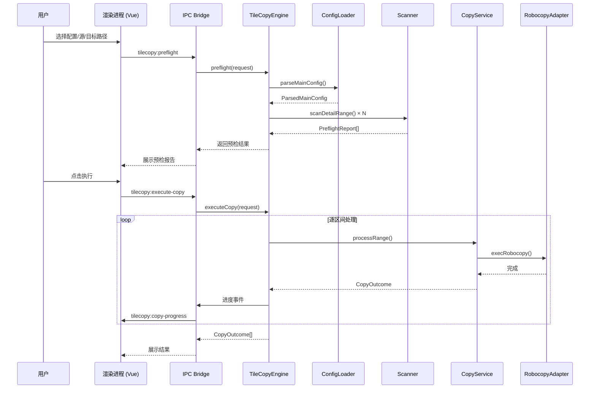

# 技术架构

> Porter 系统架构与模块设计

---

## 整体架构

Porter 采用 Electron 的**主进程-渲染进程**分离架构，通过 IPC（进程间通信）桥接业务逻辑与用户界面。

```
┌──────────────────────────────────────────────────────────────┐
│                      Renderer (Vue 3)                        │
│  ┌─────────┐  ┌─────────┐  ┌──────────┐  ┌──────────────┐  │
│  │ 路径配置 │  │ 策略配置 │  │ 预检结果  │  │ 执行进度/结果 │  │
│  └─────────┘  └─────────┘  └──────────┘  └──────────────┘  │
│                          │ IPC Bridge                        │
├──────────────────────────┼───────────────────────────────────┤
│                     Preload (index.ts)                        │
│           contextIsolation: true  │  sandbox: false           │
├──────────────────────────┼───────────────────────────────────┤
│                      Main Process                            │
│  ┌──────────────────────────────────────────────────────┐   │
│  │              TileCopyEngine（流程编排）                │   │
│  │  ┌──────────┐  ┌────────┐  ┌───────────┐            │   │
│  │  │ConfigLoader│  │Scanner │  │CopyService│            │   │
│  │  └──────────┘  └────────┘  └─────┬─────┘            │   │
│  │                                   │                   │   │
│  │                          ┌────────▼────────┐         │   │
│  │                          │ RobocopyAdapter  │         │   │
│  │                          └─────────────────┘         │   │
│  └──────────────────────────────────────────────────────┘   │
│  ┌──────────┐                                               │
│  │  Logger   │                                               │
│  └──────────┘                                               │
└──────────────────────────────────────────────────────────────┘
```

---

## 模块职责

### `index.ts` — 应用入口

- 创建 `BrowserWindow`，管理应用生命周期
- 注册所有 IPC Handler（`tilecopy:ping`、`tilecopy:preflight`、`tilecopy:execute-copy` 等）
- 管理文件/目录选择对话框
- 创建进度事件通道，将主进程进度推送到渲染进程

### `configLoader.ts` — 配置解析

三种配置模式的统一入口：

| 模式 | 触发条件 | 行为 |
|------|---------|------|
| **目录模式** | 输入路径为目录 | 读取一级子目录名称作为待处理清单 |
| **直接清单模式** | 输入为文件，且文件内条目在配置目录下找不到对应文件 | 将整个文件视为目录名清单 |
| **嵌套配置模式** | 输入为文件，且文件内条目在配置目录下存在对应文件 | 逐一解析子配置文件，按区间标签组织 |

核心函数：
- `parseMainConfig()` — 主配置解析入口
- `parseDetailConfig()` — 子配置解析
- `extractRangeLabelFromName()` — 从文件名解析区间标签
- `readConfigEntries()` — 读取配置行（自动跳过注释、表头）

### `scanner.ts` — 目录扫描与匹配

负责在源目录中扫描并匹配配置中指定的目录名。

- `scanDetailRange()` — 对单个区间执行完整的扫描流程
- `collectMatches()` — 递归收集目录匹配结果
- `discoverSubRoot()` — 动态发现子目录（当区间目录不在预期位置时）
- `calculateDirectorySize()` — 计算目录大小（可选，用于进度估算）

匹配结果状态：`exists`（已匹配）、`missing`（缺失）、`duplicate`（重复匹配）

### `copyService.ts` — 复制/移动/删除执行

根据扫描结果执行实际的文件操作。

- `processRange()` — 统一入口，根据操作类型分发到 `copyRange()` 或 `deleteRange()`
- `copyRange()` — 复制/移动逻辑，支持进度回调
- `deleteRange()` — 删除逻辑，支持进度回调
- `copyDirectoryWithProgress()` — 底层复制函数，调用 `robocopyAdapter`

冲突处理策略：
1. **跳过已存在** — 目标目录存在则跳过
2. **覆盖并合并** — 直接覆盖（Robocopy `/E` 模式）
3. **先删后复制** — 先删除目标目录再复制（Robocopy `/MIR` 或手动清理）

### `robocopyAdapter.ts` — Robocopy 封装

对 Windows 原生 `Robocopy` 命令的 Promise 封装。

- 默认使用 `/MT:32`（32 线程并行复制）
- 支持 `/E`（包含空目录）、`/MIR`（镜像）、`/MOVE`（移动）
- 静默模式：`/NFL /NDL /NJH /NJS /NC /NS /NP`
- 自动重试：`/R:3 /W:1`
- 退出码处理：`< 8` 视为成功

### `tilecopyEngine.ts` — 流程编排引擎

协调各模块的核心引擎，串联完整工作流：

```
配置解析(loadConfig) → 预检扫描(preflight) → 执行操作(executeCopy)
```

- 缓存配置和预检结果，通过签名机制避免重复解析
- 管理进度事件发射器（`EventEmitter`）
- 验证路径可达性
- 对每个区间逐一执行并汇总结果

### `logger.ts` — 日志模块

基于 `electron-log`，将日志写入 `%APPDATA%/porter/logs/` 目录。

---

## 数据流



---

## 类型体系

核心类型定义于 `src/main/types.ts`：

| 类型 | 说明 |
|------|------|
| `TileCopyJobRequest` | 前端传入的任务请求参数 |
| `DetailConfig` | 单个区间的配置信息 |
| `ParsedMainConfig` | 主配置解析结果 |
| `RangeScanReport` | 区间扫描报告 |
| `ScanFinding` | 单个目录的匹配状态 |
| `DirectoryMatch` | 匹配到的目录信息 |
| `PreflightReport` | 预检报告（配置 + 扫描） |
| `CopyOutcome` | 单次复制操作结果 |
| `CopyProgress` | 实时进度数据 |

---

## 进程通信 (IPC)

| Channel | 方向 | 说明 |
|---------|------|------|
| `tilecopy:ping` | 渲染→主 | 健康检查 |
| `tilecopy:check-paths` | 渲染→主 | 路径可达性检查 |
| `tilecopy:load-config` | 渲染→主 | 加载并解析配置 |
| `tilecopy:preflight` | 渲染→主 | 执行预检扫描 |
| `tilecopy:execute-copy` | 渲染→主 | 执行复制/移动/删除 |
| `tilecopy:select-*` | 渲染→主 | 打开文件/目录选择对话框 |
| `tilecopy:copy-progress` | 主→渲染 | 实时进度推送 |
